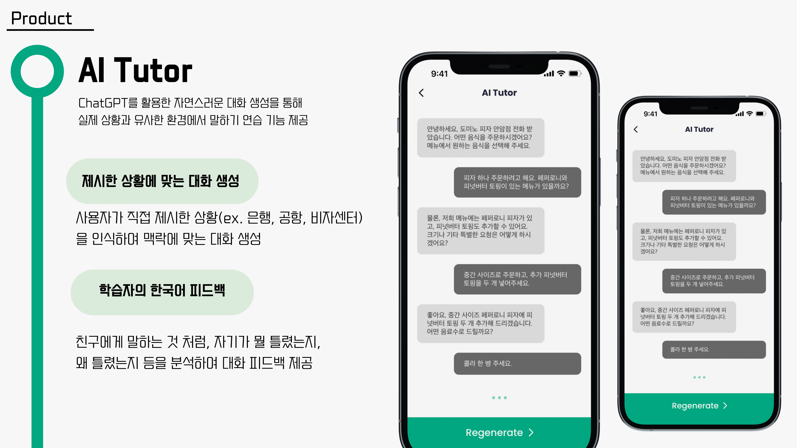
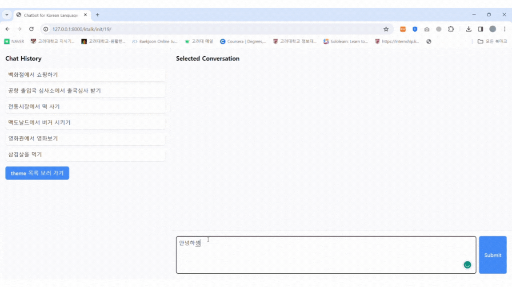

## 프로젝트 소개

고려대학교 창의적소프트웨어창업론 수업 프로젝트

- 프로젝트 기간: 23.09 ~ 23.12.
- 프로젝트 기술: `Python Django`, `GPT API`
- 프로젝트 링크: [K-talk pro 예시 페이지](https://port-0-k-talk-9zxht12blq9pxr4s.sel4.cloudtype.app/ktalk/init/)

## 예시 이미지 및 배포 사이트

## 핵심 기능
- **AI와 상황별 대화 기능**
    - 사용자는 특정 시나리오에 대해 AI와 자연스러운 대화를 나누고, AI는 상황에 맞는 적절한 반응을 제공
- **대화 상황 관리 기능**
    - 관리자의 대화 상황 추가, 수정, 삭제 기능 제공

## 도전 과제 및 해결책
- GPT API와 프롬프트 기반 역할 지정
    - GPT API를 활용하여 AI에게 다양한 역할을 부여
    - 대화 문맥을 기억하고 데이터베이스에 저장하는 기능을 구현하여, AI가 지속적인 대화 흐름을 유지
- 서비스 배포 경험
    - 프로젝트를 직접 배포하여 사용자가 쉽게 접근하고 사용할 수 있게함

## 프로젝트 확장 가능성
- **한국어 사용 피드백의 구현**
    - 한국어 학습 교육 과정을 기반으로, 더 정교한 한국어 사용 피드백 기능 구현
- **문장 맥락 이해 지원 기능**
    - 사용자가 입력한 문장이나 AI가 대답한 문장과 **유사한 예능이나 드라마의 대사를 찾아 제시**
    - 문장의 맥락을 더 쉽게 이해할 수 있게 하는 기능 지원
- 외국인 대상 한국어 학습 플랫폼 확장
    - '스픽' 앱과 유사하게, 외국인이 한국어를 쉽게 배울 수 있는 플랫폼으로 프로젝트를 확장